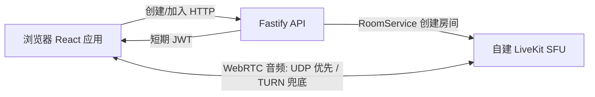

# Voice Room 设计说明

## 目标

构建一个由邀请链接组织的小群网页语音聊天室。每位用户选择昵称、预置头像和输入设备后进入房间；房间展示成员、静音和发声状态。首版服务 2–10 人的聊天、弹唱和乐器展示，桌面 Chrome/Edge 是音质验收目标，手机浏览器支持基本加入、播放与通话。

## 已确定的产品边界

- 身份为昵称和预置头像，不含游戏角色、账号体系或主持人权限。
- 通过创建临时房间和分享链接邀请参与者。
- 只做实时采集与传输；不录音、不下载、不保存聊天或用户资料。
- 不承诺跨网络同步合奏；目标是尽可能低延迟的聊天和乐器展示。
- 房间最多 10 人；没有数据库，房间由 LiveKit 维护，空置 5 分钟清理。

## 架构

前端使用 `livekit-client` 连接 SFU。后端持有 LiveKit API 密钥和密钥，仅暴露创建房间与加入接口。每个加入请求生成新的随机参与者 identity，昵称和头像作为 participant metadata。token 只授予目标房间的 join、publish 和 subscribe 权限。

本地由 Docker Compose 启动 LiveKit 和 Redis；生产以官方 Caddy Layer4/SNI 配置承载网站、RTC 和 TURN 域名。HTTPS/WSS 与 TURN/TLS 使用 TCP 443，媒体优先使用 UDP，服务端 API 端口不直接暴露公网。

## 音频设计

默认**语音模式**请求单声道 48 kHz，开启回声消除、降噪、自动增益、DTX 和 RED。**乐器原声模式**优先请求双声道 48 kHz，关闭回声消除、降噪、自动增益、语音隔离与 DTX；目标上限为单声道 128 kbps、双声道 256 kbps。实际设备能力必须从轨道设置读取，界面不得宣称请求值已被硬件满足。

切换设备或模式时重新采集并发布同一麦克风轨道，保留原静音状态。乐器模式提示用户佩戴耳机，避免关闭回声消除后的扬声器回授。LiveKit 的 active-speaker 状态与本地/远端轨道能量分析共同驱动成员卡片的“正在发声”指示，从而覆盖持续乐器音。

## 用户流程与失败处理

1. 主页创建随机、不可枚举的房间，复制邀请链接。
2. 被邀请者填写昵称、头像，选择设备与音质模式；不授权麦克风仍可作为听众进入。
3. 前端从 API 获得 token 并连接房间；首次播放由用户操作解锁。
4. 发生短暂断网时由 SDK 重连；完全断开时客户端重新签发 token 后入场。
5. 设备被拔出、权限被拒绝、房间失效或满员均给出可操作错误信息；离开时释放采集轨道、分析器和监听器。

## 验收标准

- 两个独立浏览器客户端可双向实时通话，并可看到双方的静音和发声状态。
- 外接麦克风或声卡可在入场前和房间内切换；失败不会自动打开麦克风。
- 乐器模式能传递持续弱音和尾音，不由 DTX 或人声处理截断。
- 11 个并发加入尝试最多接纳 10 人；空房 5 分钟后不可通过旧 token 重建。
- 本地 Docker 环境、前后端测试、类型检查、lint 和生产构建均可运行。
